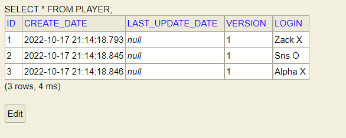

# TicTacToe Game API
TicTacToe Game API Kata implementation , producing multiple endpoints to simulate a game between two players
# Prerequisites

In order to run the application, you need to have:
1. JDK 17 (https://www.oracle.com/java/technologies/downloads/)
2. Maven 3.8.6 (https://maven.apache.org/download.cgi).
3. Git (https://git-scm.com/downloads)
   You also need to configurate your user and system path variables for both java and maven. You also need to have git installed in order to clone the project .


### Run it locally
1. Open terminal and clone the repo:
```shell
git clone https://github.com/2022-DEV1-067/TicTacToe.git
```
2. Make sure you are in project directory  in order to build and package the application with the following Cmd Commande:
```shell
mvn clean install
```
3. Go to /target inside TicTacToe and run the folowing command to lunch the application:
```shell
java -jar TicTacToe-0.0.1-SNAPSHOT.jar
```

## Data Base

This application has H2 Database , It is a embeded in-memory database which means it only lasts as the application is running

You can access it by browsing : http://localhost:8090/h2-console

User Name = user

Password = popcorn

## API Documentation

The documentation of the API is made by OpenAPI 3.0 , it shows all the Endpoints of the application

You can access after running the application it in to http://localhost:8090/swagger-ui/

##  Running the tests

```shell
mvn test
```

##  User Guide

Initially the data base is initialized with these players :



###  Create a game :

please get into : http://localhost:8090/swagger-ui/

then follow these instructions :

1. Click on [POST] /game/startGame
2. Click on "Try it out" Button
3. replace the "string" with one of LOGIN Player in the Request Body section
4. Click on Execute Button
5. Repeat the same process with a different LOGIN Player (The game Require 2 players to start / X player will start by default  )

###  Cancel a game :
1. Click on [POST] /game/cancel
2. Select the id of the game from the H2 data base
3. Replace the 0 and fill the game id in the request body section
4. Click on Execute Button

###  Play (Make Game Move) :
1. Click on [PUT] /game/makeMove
2. Click on "Try it out" Button
3. you will find a Json Format as bellow

```shell
{
  "id": 0,
  "version": 0,
  "createDate": "2022-10-17T20:28:35.152Z",
  "lastUpdateDate": "2022-10-17T20:28:35.152Z",
  "playerLogin": "string",
  "gameId": 0,
  "position": 9
}
```
4. to play you have to fill only these fields with the correct information including the correct Player Login and and game Id
5. The positions filled in must respect this table

```shell
{
  "playerLogin": "string",
  "gameId": 0,
  "position": 9
}
```
 -------------------------
|   1   |   2   |   3   |
-------------------------
|   4   |   5   |   6   |
-------------------------
|   7   |   8   |   9   |
-------------------------
